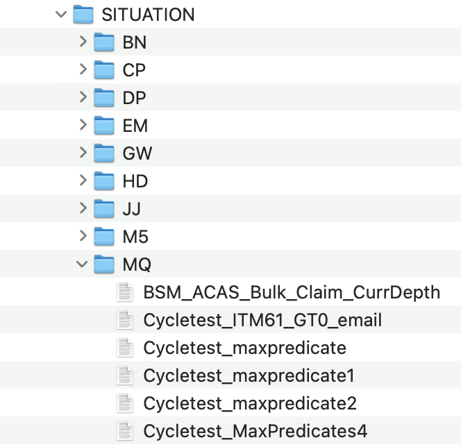

## Extract ITM data

The Migration Tool requires IBM Tivoli Monitoring (ITM) data to be exported using `tacmd` command line interface (CLI) commands.

The following `tacmd` CLI commands are used to extract the ITM Situation data required as input to the Migration tool:
- `bulkexportsit` - Export all the available situations from the Tivoli Enterprise Monitoring Server.
- `listsystemlist` - List the situations on the hub monitoring server.
- `viewsystemlist` - List the configuration of a managed system group to be displayed or saved in an export file.

_Refer to the [IBM Tivoli Monitoring v6.3 Command Reference](https://www.ibm.com/docs/en/tivoli-monitoring/6.3.0?topic=reference-pdf) for more details on using the **tacmd CLI command**._

**Below are the steps required to extract the ITM Situation data required as input to the Migration tool.**

1. Open a terminal and connect to the ITM system - e.g. `ssh root@scm-rhx64a.tivlab.raleigh.ibm.com`
1. Locate tacmd command - e.g. `cd /opt/IBM/ITM/bin`
1. Login to ITM - e.g. `./tacmd login -s localhost`
1. Create the target extract directory - e.g. `mkdir /tmp/extract/`

**Export the ITM Situations:**

5. Export ALL the Situations (including Distribution list) in XML format - e.g. `./tacmd bulkexportsit --distribution --path /tmp/extract/`
_OR_ 
6. if you want to extract a subset of the Situations by type - e.g. `./tacmd bulkexportsit --type MQ --path /tmp/extract/`

**Export the Managed Systems:**

7. List the managed systems e.g. ./tacmd listsystems > /tmp/extract/listSystems.txt
8. List the managed system group catalog e.g. ./tacmd listsystemlist > /tmp/extract/listsystemlist.txt
9. Export the configurations of each custom managed system group (members) e.g. ./tacmd viewsystemlist -l LouiseMQGroup -e > /tmp/extract/syslistLouiseMQGroup.txt

9. Compress all the extracted data (i.e. Bulk/Situations folder and contents, managed system files)and copy to local system where Migration Tool is installed  e.g. `tar -cvf bulkExport .`

