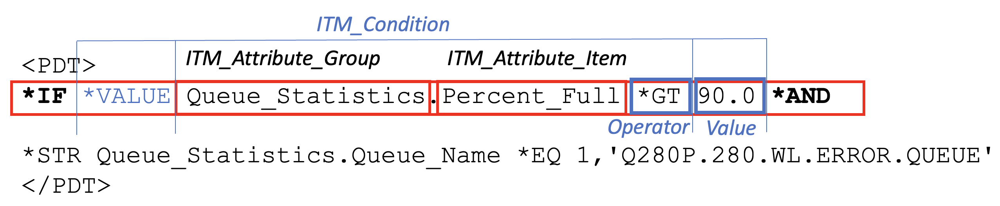
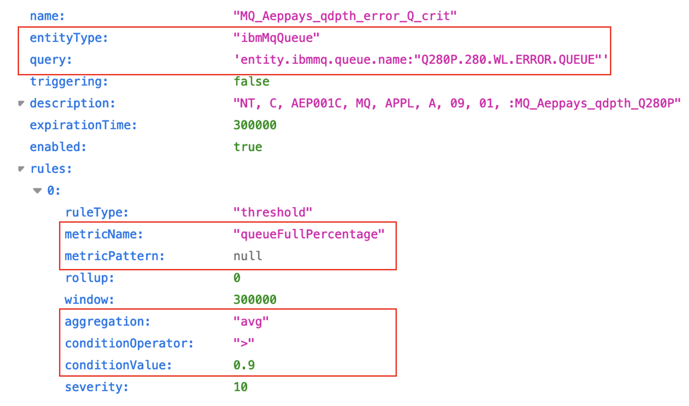
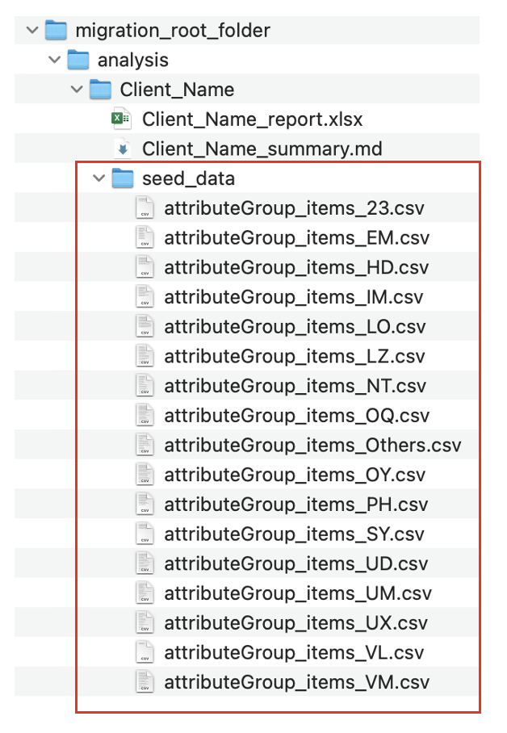
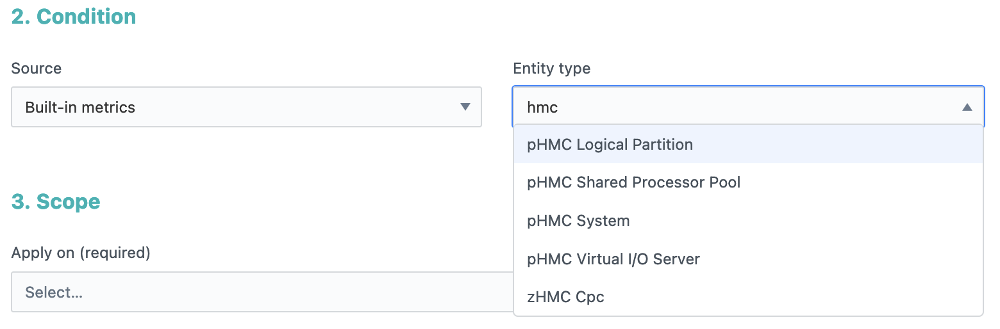
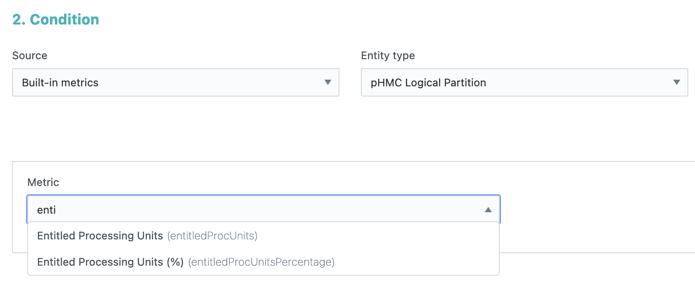

**ITM to Instana Metric Mappings**

The Migration Tool uses the following files to assist with data transformation.

- Metric Mapping file - [MetricMapping.csv](https://ibm.box.com/s/vqpnl80g961w1idfme7wqhjgbif3di9i)
- Keyword Mapping file - [itm2InstanaMapping.csv](https://ibm.box.com/s/y2t70yg6as4rhc3axr4mf11upuol9ubg)

These files have been created manually using the approach described [below](#how-to-create-a-mapping).

___About the Metric Mappings___

The Migration Tool uses the [MetricMapping.csv](https://ibm.box.com/s/vqpnl80g961w1idfme7wqhjgbif3di9i) file to lookup ITM Attributes used in the Situation threshold definition and identify the mappings to use for the Instana equivalent metric values (if available).

For example, the snippet below shows how the ITM "Attribute Group" and "Attribute Item" is used in a Situation threshold formula definition (also referred to as a "PDT").



The Migration Tool locates the `ITM_Attribute_Group` and `ITM_Attribute_Item` in the mapping file and returns the corresponding Instana entry.  This Metric Mapping data is used to populate the following Instana Event properties:

- Entity Type: `entityType`
- Metric condition: `metricName`/`metricPattern` (`prefix`, `postfix`), `aggregation`
- Scope Dynamic Focus Query filter: `query`



The Metric Mapping file includes additional information to assist the migration, such as [conversion rules](#conversion-rules) to apply; default values to use, whether an equivalent metric is Supported by Instana or not (or is on their roadmap).

The Keyword Mapping file ([itm2InstanaMapping.csv](https://ibm.box.com/s/y2t70yg6as4rhc3axr4mf11upuol9ubg)) file is also used to lookup ITM values used in the Situation data, such as State enums used in the "PDT" formula and Severity classification defined in the "SITINFO", and returns the Instana equivalent value to use.

___Metric Mappings are a Live document___

Both IBM Tivoli Monitoring and Instana support many different agent types for various operating systems, subsystems, databases, and applications.  The [MetricMapping.csv](https://ibm.box.com/s/vqpnl80g961w1idfme7wqhjgbif3di9i) contains a subset of the basic mappings with the view that this is an evolving file which will continue to be updated as new types and attributes are identified and with increased usage of the Migration Tool.  It will also need to be updated alongside Instana metric updates.

___Summary of Agent types with Metric Mappings defined:___


| Agent                                                  | ITM Folder ID |
| -------------------------------------------------------- | --------------- |
| ITCAM Agent for WebSphere DataPower Appliance          | BN            |
| WebSphere MQ Monitoring Agent                          | MQ            |
| WebSphere Message Broker Monitoring Agent              | QI            |
| IBM Tivoli Composite Application Manager Agent for DB2 | UD            |
| OMEGAMON XE for DB2 PE and PM on z/OS                  | DP            |
| Monitoring Agent for WebSphere                         | YN            |
| Monitoring Agent for UNIX OS                           | UX            |
| Monitoring Agent for Linux OS                          | LZ            |
| Base Monitoring Agent for HMC                          | PH            |
| Monitoring Agent for Windows OS                        | NT            |
| Agentless Monitoring for Windows Operating Systems     | R2            |
| Agentless Monitoring for AIX Operating Systems         | R3            |
| Agentless Monitoring for Linux Operating Systems       | R4            |
| Agentless Monitoring for HP-UX Operating Systems       | R5            |
| Agentless Monitoring for Solaris Operating Systems     | R6            |
| Monitoring Agent for VMware VI                         | VM            |
| Monitoring Agent for i5/OS                             | A4            |
| Universal Agent                                        | UM            |

---

## How to Create a Mapping

**Tips for Creating/Updating the ITM to Instana Metric Mappings**

A combination of the following is used to build the metric mapping file, along with talking to [Ben Stern][Ben] / [Cesar Araujo][Cesar], product development teams and applying previous product knowledge and guessing!... ultimate confirmation will come from validating a migration with the client.

1. Client data to extract ITM attribute list
2. Instana UI to explore metrics
3. [Clyde Foster][Clyde]'s HTML reports to compare with previously defined mappings
4. Instana metric catalog -  to determine the exact ids to use.  
The metric catalog is available from the Instana instance via URL path: {instana-instance}/api/infrastructure-monitoring/catalog/metric-definitions/built-in/
e.g. [Instana Sandbox metric catalog](https://ibmdevsandbox-instanaibm.instana.io/api/infrastructure-monitoring/catalog/metric-definitions/built-in/)

___Identifying ITM Attributes found in Client Situation data___
Unfortunately there is no single list of all the ITM attributes available in one place.  Tivoli documentation does include references to Agent attributes such as for Operating Systems (e.g. [Linux Agent attributes](https://www.ibm.com/docs/en/tivoli-monitoring/6.3.0?topic=laug-attributes)) - however, it is more preferable to focus on building a list based on attributes found in actual client data, and avoiding time spent on mapping attributes that may never be used.

So the list of ITM attributes in the Metric Mapping file is built from different client data sets:

- Run the Migration Tool Analyser against client Situation data to get a list of all the unitque ITM attributes found in the data.
  - A separate file is created for all attributes found under the analysed folder (e.g. 'attributeGroup_item_MQ.csv' is created from analysis of the MQ folder).
  - The files are stored in a "seed_data" folder under the client's data analysis folder.
    

The folder Id and attribute name is added an entry along with the folderId is used to populate columns A to C of the metric mapping file.

___Identifying the Instana mapping data to use___

The ITMProductCodes.csv file can be used to get the description of the folderId to help suggest the entity type to use and filter the built-in metrics

For example, the "PH" folder ID contains Situations using the Base Monitoring Agent for HMC.
Typing "hmc" in the Instana UI displays 5 supported Entity types:

The ITM Attribute Group may help to refine these options further, if not you can select each entity type and search through their metrics to see if there is an obvious match for the ITM Attribute Item.
e.g. KPH_SERVER_LPARS.Entitled_Capacity_Used_Pct --> pHMC Logical Partition
and searching for the "entitled" key word filters the list of metrics down to 2 - one is for Units and the other is a percentage - which is the one we want in this example as the Attribute Item ends with "Pct".


So we have found a good match.

Next we want to look up this metric in the Instana catalog to get the exact Ids to use in the migration.  Searching on the strings defining the metric in the UI will likely take you direct to the catalog entry.

```
{
    "entityType": "phmcLPAR",
    "formatter": "NUMBER",
    "label": "Entitled proc units",
    "description": "Entitled processor units to a logical partition for a specified time interval",
    "metricId": "entitledProcUnits"
}
```

The Instana metric catalog data (entityType and metricId) can now be added to the metric mapping entry.

Note: metricId maps to metric name.  A metric pattern would look like this in the catalog:

---

## Conversion Rules

Below is a list of the conversionRule options used by the Migration Tool:

- percentage
- KBtobyte
- MB2byte
- divideBy
- enumConversion - applies to enumerated list values (e.g. status) where itm2instanaMapping.csv is also used to lookup the equivalent Instana value.
- systemEvent - a system rules template is used instead of the default Built-in template when creating an Event.
- maintenanceWindow - if "Local_Time" attributes are used in the ITM PDT formula then a Maintenance Window must also be created by the Migration Tool.
- linkedAttribute - used to complete the metric pattern definitions

[Ben]: mailto:bstern@us.ibm.com?subject=ITM2Instana%20Migration
[Cesar]: mailto:caraujo@us.ibm.com?subject=ITM2Instana%20Migration
[Clyde]: mailto:fosterc@us.ibm.com?subject=ITM2Instana%20Migration
