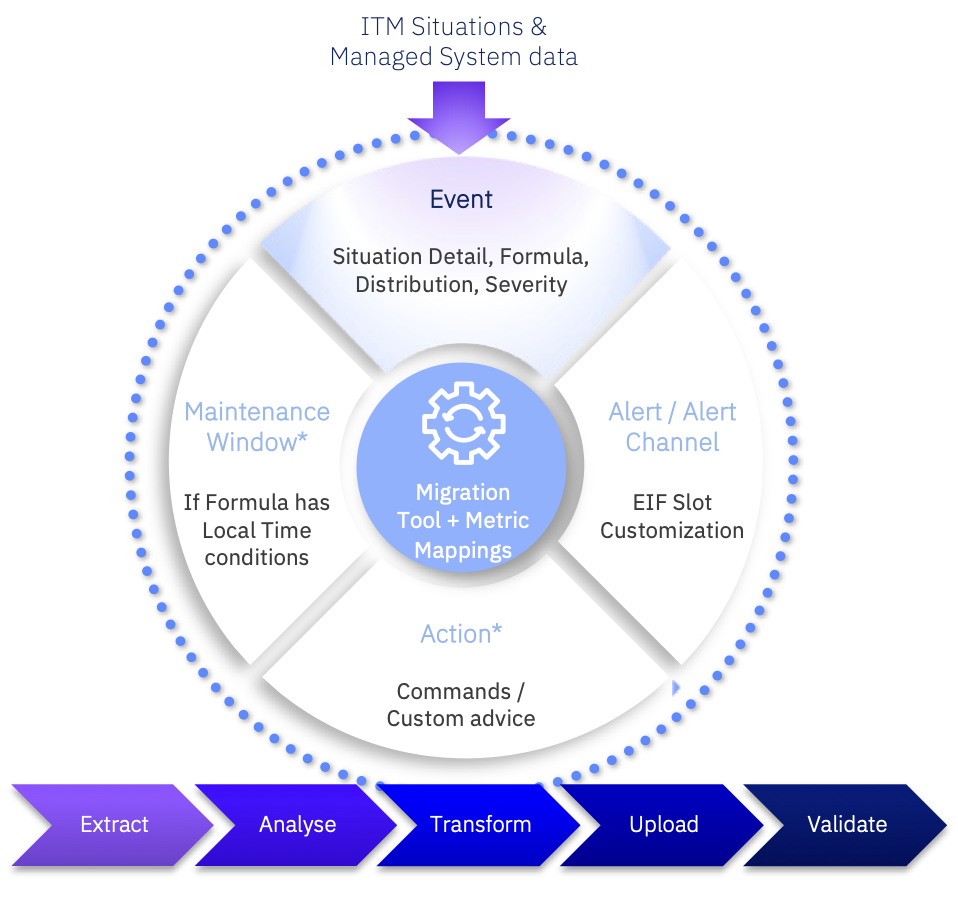

This is a guide for using the ITM2Instana Migration Tool.

**Summary of migration approach:**

1. [Extract ITM data](./extract.md)
2. [Analyse ITM data](./analyse.md) (exported as XML) and create analysis report
3. [Pre-Process seed data](./preprocess.md) into required Migration Tool format
4. [Transform ITM data & apply mapping rules](./transform.md)
5. [Upload transformed data to Instana](./upload.md)
6. [Validate migration](./validate) and create comparison report

**Migration Tool Seed Data**

1. [ITM2Instana Metric Mappings](./metric_mappings.md)
2. [ITM2Instana Keyword Mappings](./metric_mappings.md)

[Instana Built-In Metric Catalog](https://ibm.box.com/s/36kqth4zskzf1erik04ea4lcu49ncsio) - used when creating  seed data mapping files.

